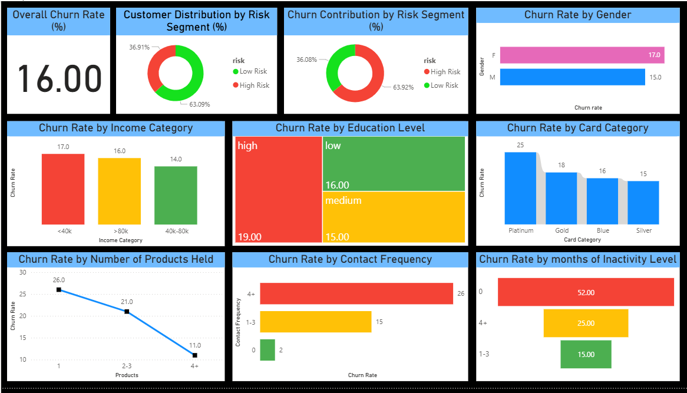

# Customer Churn Analytics: Churn Profiling, Retention Analysis, Prediction & Dashboard (SQL · Python · Power BI)

An end‑to‑end churn analytics project covering **churn profiling (uni/bivariate)**, **retention analysis (risk segmentation and distribution)**, **predictive modeling (3 classifiers)**, and a **Power BI dashboard**. 

---

## What this project answers
- What is the **baseline churn rate** and how does it vary across customer attributes?
- Which **segments** meaningfully drive churn (and where should retention spend go)?
- Which **behaviors** (transactions, balances, utilization, inactivity, contact frequency) are the strongest churn drivers?
- How accurately can we **predict churners ahead of time**, and which model should we trust?
- What **KPIs** should be watched in a live dashboard?

---

## Tech Stack
- **SQL (MySQL)** – KPI queries
- **Python** – pandas, scikit‑learn, seaborn, matplotlib
- **Power BI** – interactive dashboard (PBIX)

---

## Repository Structure
```
.

├─ Churn_Profiling_&_Retention_Analysis.ipynb
├─ Churn_Prediction.ipynb
├─ Dashboard.pbix
├─ report.pdf
├─ kpis.sql
├─ assets/
│  └─ dashboard.png        # screenshot for README
└─ README.md
```

---

## Data (summary)
A standard credit‑card churn dataset with demographic features (gender, age, dependents, income, education), account attributes (card category, tenure, products), engagement (inactivity months, contact frequency), and monetary usage (transactions, amounts, revolving balance, utilization).

---

## Highlights & Insights
- **Baseline churn rate:** ~**16%** (establishes the “average risk” yardstick).
- **Risk Segmentation** (from profiling rules): customers tagged **High‑Risk** show ~**28%** churn vs **~9%** for Low‑Risk; although **High‑Risk** is ~**37% of all customers**, they form ~**64% of all churners**.
- **Top churn drivers** (from tree‑based model importances): **transaction count**, **total transaction amount**, and **total revolving balance** dominate; demographics contribute far less.
- **Behavioral signals**: prolonged **inactivity (4+ months)** and **frequent bank contacts (4+)** correlate with much higher churn; customers with **4+ products** are markedly stickier than those with a single product.

> The dashboard turns these into monitorable KPIs so non‑technical users can drill down by segment, product holdings, inactivity, and contact frequency.

---

## Modeling
Three supervised models were trained on the engineered dataset (encoding + scaling where appropriate, with class imbalance considered):
- **Logistic Regression** – quick baseline; struggled with the heavy class imbalance.
- **Random Forest** – strong uplift; identified most churners with fewer false alarms.
- **XGBoost** – best overall; high recall on churners while keeping accuracy very high.

### Metrics (test set)
| Model | Precision (0) | Recall (0) | F1 (0) | Precision (1) | Recall (1) | F1 (1) | Accuracy |
|---|---:|---:|---:|---:|---:|---:|---:|
| Logistic Regression | 0.84 | 1.00 | 0.91 | 0.00 | 0.00 | 0.00 | 0.84 |
| Random Forest       | 0.95 | 0.99 | 0.97 | 0.94 | 0.72 | 0.81 | 0.95 |
| XGBoost             | 0.98 | 0.99 | 0.98 | 0.94 | 0.89 | 0.91 | 0.97 |

> **Interpretation:** LR collapses under class imbalance; RF is a dependable production baseline; XGBoost delivers the strongest recall on churners without sacrificing overall accuracy.

---

## Retention Recommendations Overview
- **Prioritize High‑Risk segment** (2/3 of all churners): targeted offers, service recovery, proactive outreach.
- **Re‑engage inactive customers (4+ months):** reminders + time‑bound rewards; promote regular spending through limited time rewards or discounts.
- **Address dissatisfaction** signaled by **4+ contacts**: faster issue resolution, Ensure customer problems are fully resolved on fewer contacts, Monitor dissatisfaction for high-contact customers.
- **Right‑size products:** encourage **1–3 product holders** to adopt more products; steer **low‑income platinum** users toward affordable tiers; offer loyalty bonuses to **4+ product holders**.
- **Usage‑linked incentives:** tiered cashback/milestone rewards to lift **transaction counts/amounts** and reduce churn propensity.

---

## Power BI Dashboard
**Tabs:** Executive KPIs, Demographics, Products, Engagement, Risk.

**KPIs (examples):**
- Overall Churn Rate (%)
- Churn by Risk Segment (Distribution & Contribution)
- Churn by Gender / Income / Education
- Churn by Card Category
- Churn by Products Held
- Churn by Inactivity Months
- Churn by Contact Frequency

> Distinct visuals per KPI (cards, donut, bar, line, treemap, funnel), high‑contrast color coding by risk, and consistent typography for readability.



---


## Author
Dev Bhalodia
