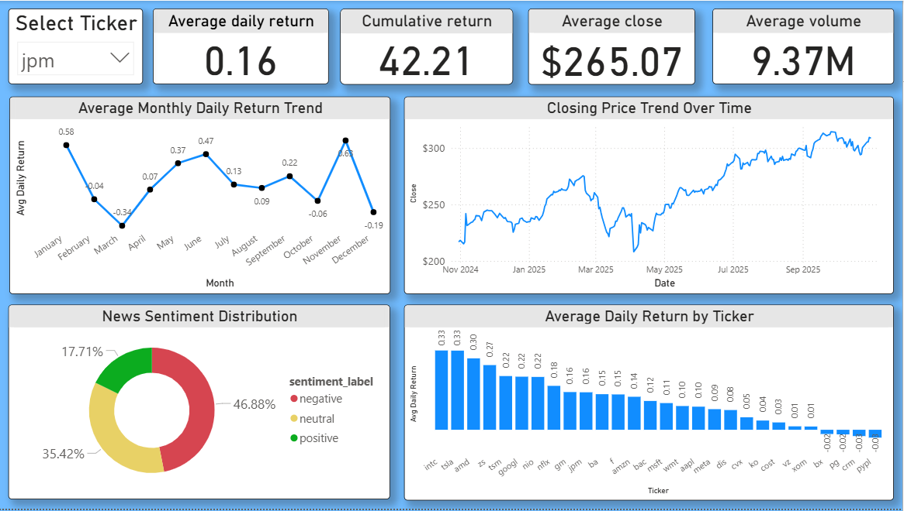

# Automated, Metadata-Driven Stock & News ETL Pipeline with FinBERT Sentiment & LSTM Forecasting

## Overview

This project is a **fully automated, metadata-driven Python-based incremental ETL and analytics system** that extracts real-time **stock data** and **financial news** using APIs, performs **exploratory data analysis (EDA)**, applies **sentiment analysis with FinBERT**, and **forecasts stock prices** using an LSTM deep learning model.  
It is designed for **incremental updates**, **zero manual intervention**, and **weekly automation via Windows Task Scheduler**.

------------------------------------------------------------------------

## Key Highlights

- **End-to-End Data Pipeline:** Custom-built using Python without any third-party ETL tools.  
- **Incremental Processing:** Extracts, transforms, and loads only *new data* since the last run using a `metadata.json` control file.  
- **API-Driven:** Fetches stock data from **YFinance API** and financial news from **News API**.  
- **Metadata-Driven Orchestration:** Achieves reproducibility and scalability through metadata tracking.  
- **Automation:** Scheduled weekly with **Windows Task Scheduler** using a `.bat` runner script.  
- **Exploratory Data Analysis (EDA):**  
  - Performed **univariate** analysis to explore price distributions, volatility, and volume behavior.  
  - Conducted **bivariate** analysis (with `daily_return` as the target) to assess feature correlations and relationships.  
- **Sentiment Analysis:** Utilizes **FinBERT** to extract positive, negative, and neutral sentiments from financial headlines and correlates sentiment with short-term market returns.  
- **Forecasting:** Employs **LSTM (TensorFlow)** for close-price prediction enhanced by engineered features (MA, RSI, MACD, Bollinger Bands, lag features, etc.).  
- **Visualization:** Interactive **Power BI dashboard** connected directly to the **MySQL warehouse** for real-time insights on returns, sentiment, and trends.

------------------------------------------------------------------------

## ETL Pipeline Architecture


------------------------------------------------------------------------

## Project Structure

Got it — here’s the corrected Markdown directory structure reflecting that `run_etl.bat` is in the **root directory**, not inside `etl/`:


```
stock_sentiment_pipeline/
│
├── etl/
│   ├── config.yaml
│   ├── extract.py
│   ├── transform.py
│   ├── load_mysql.py
│   ├── run_etl.py
│   └── metadata.json
│
├── data/
│   ├── raw/
│   │   ├── stocks.csv
│   │   └── news.csv
│   └── processed/
│       ├── stocks_clean.parquet
│       └── news_clean.parquet
│
├── notebooks/
│   ├── eda_&_sentiment_analysis.ipynb
│   └── forecasting_lstm.ipynb
│
├── dashboard/
│   └── stock_sentiment_dashboard.pbix
│
├── .env
├── run_etl.bat
├── requirements.txt
└── README.md
```


------------------------------------------------------------------------

## ETL Breakdown

### Extract

-   Fetches **stock price data** from `YFinance API` and **financial
    news** from `News API`.\
-   Uses `metadata.json` to extract only *new records* since the last
    refresh (incremental load).\
-   Stores raw datasets as CSV in `/data/raw`.

### Transform

-   Cleans, deduplicates, and validates data.
-   Computes engineered stock metrics:
    -   `daily_return`, `cumulative_return`, `daily_pct_change`,
        `price_range`.
-   Applies **FinBERT sentiment analysis** on financial headlines,
    generating:
    -   `sentiment_label` (positive / negative / neutral)
    -   `sentiment_score` (probability of correctness)
-   Transformed data stored as `.parquet` for schema consistency.

### Load

-   Loads only *new transformed data* into **MySQL** using `SQLAlchemy`.
-   Updates `metadata.json` with latest dates post successful load.

------------------------------------------------------------------------

## Sentiment Analysis

-   FinBERT (pre-trained financial BERT) applied to each headline.
-   Output:
    -   `sentiment_label` → "positive", "neutral", "negative".
    -   `sentiment_score` → model confidence.
-   Combined with stock return trends to study how sentiment affects
    future price movement.

------------------------------------------------------------------------

## Forecasting (LSTM)

-   Used **LSTM (TensorFlow)** for close price prediction.
-   Engineered features for temporal learning:
    -   MA(7, 30), RSI(14), MACD, Bollinger Bands, lag & rolling stats,
        volume change.
-   Trained per ticker to capture unique volatility & seasonality
    patterns.

------------------------------------------------------------------------

## Power BI Dashboard

Connected the **MySQL data warehouse** to **Power BI**, enabling dynamic updates through incremental data refresh. Each time new stock and news records are appended via the ETL pipeline, the dashboard automatically reflects the latest data upon refresh—ensuring real-time visibility into market trends and sentiment insights.
  

------------------------------------------------------------------------

## Tech Stack

**Languages & Frameworks:** Python, TensorFlow, Pandas, SQLAlchemy\
**APIs:** YFinance API, News API\
**ML Model:** LSTM\
**Database:** MySQL\
**Visualization:** Power BI\
**Scheduler:** Windows Task Scheduler\
**NLP Model:** FinBERT

------------------------------------------------------------------------

## Automation & Reproducibility

-   `run_etl.py` orchestrates all 3 stages (extract → transform →
    load).\
-   `.bat` script scheduled via **Task Scheduler** for weekly
    execution.\
-   Metadata ensures reproducibility, incremental refresh, and error
    recovery.

------------------------------------------------------------------------

## Results

-   Weekly automated ingestion of live stock & news data.
-   Sentiment-aware analysis enhances interpretability of market
    movements.
-   Time-series models deliver consistent trend forecasting performance.
-   Interactive BI dashboards provide real-time analytics.

------------------------------------------------------------------------


